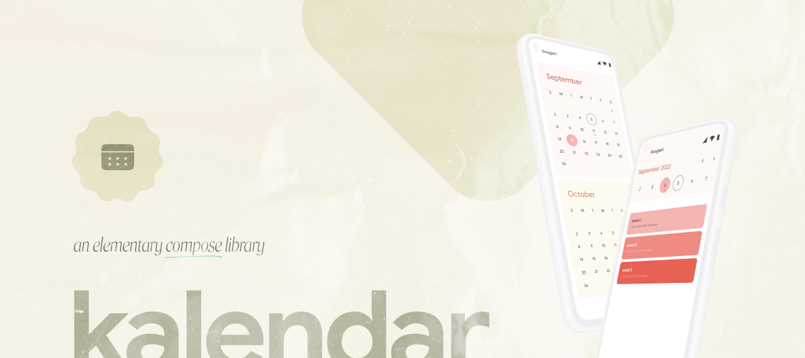

### Kalendar - An Elementary Compose Calendar.



This is a calendar to integrate Calendar with Custom design in your jetpack compose project.You can
also add list of events for your days.
_Made with ❤️ for Android Developers by Himanshu_

[](https://search.maven.org/artifact/com.himanshoe/kalendar)
[](https://mailchi.mp/kotlinweekly/kotlin-weekly-286)
[](https://github.com/hi-manshu)
[](https://twitter.com/hi_man_shoe)  
[](https://github.com/hi-manshu/Kalendar/releases/latest/download/kalendar-sample.apk)

## Introduction

With Compose getting the attention, it was about time to have its own Calendar. Kalendar is all
about it with the customization and design.

## Setup

To add Kalendar, add this dependency,

```gradle  
dependencies {  
  .....
  implementation("com.himanshoe:kalendar:1.1.0")
}  
```

or to use Kalendar Endlos, add this dependency,

```gradle 
dependencies {    
  .....  
  implementation("com.himanshoe:kalendar-endlos:1.0.0")
 } 
 ```

## Kalender gif

## To See More Detail Readme

- [Kalendar](docs/Kalendar.md)
- [KalendarEndlos](docs/KalendarEndlos.md)

Please drop a star if you like it ❤️