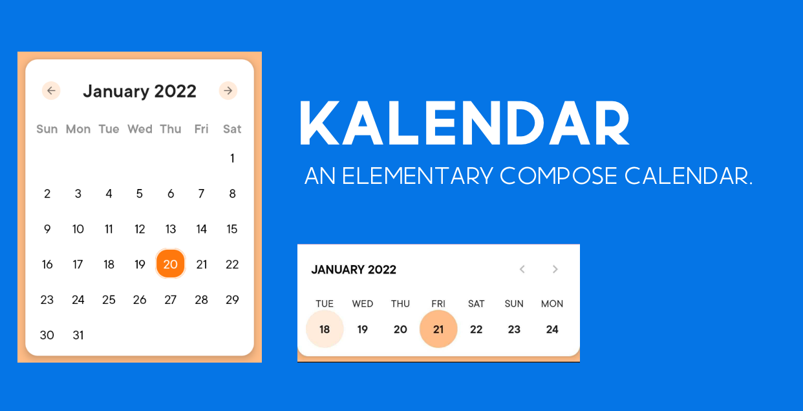

### Kalendar - An Elementary Compose Calendar.


This is a calendar to integrate Calendar with Custom design in your jetpack compose project.
_Made with ❤️ for Android Developers by Himanshu_

[](https://search.maven.org/artifact/com.himanshoe/kalendar)
[](https://github.com/hi-manshu)
[](https://twitter.com/hi_man_shoe)

## Introduction

With Compose getting the attention, it was about time to have its own Calendar. Kalendar is all
about it with the customization and design.

## Implementation

### Gradle setup

In `build.gradle` of app module, include this dependency

```gradle
dependencies {
        implementation("com.himanshoe:kalendar:0.0.1-alpha1")
}
```
### Usage

#### 1. Setup the Kalendar
```kotlin
    Kalendar(kalendarType = KalendarType.Firey(), onCurrentDayClick = {
      //handle the date click listener                                                       
    },errorMessage = {
      //Handle the error if any
    })

```

### 2. Pass KalendarType
You need to pass the KalendarType with its value in the constructor. It has two values `Firey` and `Ocenic`. Firey repesents the MonthView like:


and Ocenic represents the Week View.


### 3. Edit KalendarKonfig
By default it takes the initial values added to it. But you can customize you calendar  by editing the params which looks like,
```kotlin
data class KalendarKonfig(
    val yearRange: YearRange = YearRange(),
    val backgroundColor: Color? = null,
    val calendarColor: Color? = null,
    val hasRadius: Boolean = true,
    val elevation: Dp = if (hasRadius) Grid.One else 0.dp,
    val shape: Shape = ButtomCurvedShape,
)
```
where,
```kotlin
YearRange takes value min-max for years in Int
```

