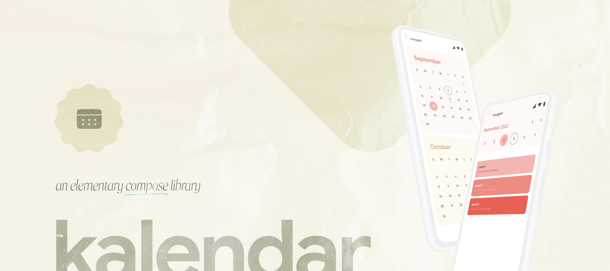

## Kalendar - An Elementary Compose Calendar.


[](https://maven-badges.herokuapp.com/maven-central/com.himanshoe/kalendar)
[](https://maven-badges.herokuapp.com/maven-central/com.himanshoe/kalendar-endlos)
[](https://mailchi.mp/kotlinweekly/kotlin-weekly-286)
[](https://androidweekly.net/issues/issue-533)
[](https://github.com/hi-manshu)
[](https://twitter.com/hi_man_shoe)  

The Kalendar library is a powerful tool for creating calendar components in Android apps using
Jetpack Compose. It provides customizable calendar views with various features and functionalities.

The Kalendar library simplifies the process of creating interactive and visually appealing calendars
in Android apps. With its flexible configuration options, event integration, and interactive
callbacks, you can easily build powerful calendar components that enhance the user experience.

_Made with ❤️ for Android Developers by Himanshu_

Kalendar supports three types of calendar:

- **Oceanic**: Represents the WeekView.
- **Firey**: Represents the MonthView.
- **Endlos**: Represents a scrolling calendar that starts from the current month.

### Getting Started
To integrate the Kalendar library into your Android app, follow these steps:

Add the Kalendar library as a dependency in your app-level build.gradle file:

```gradle
implementation 'com.himanshoe:kalendar:<latest-version>'
```

For adding the Scrolling calendar, Endlos, add the following dependency:

```gradle
implementation 'com.himanshoe:kalendar-endlos:<latest-version>'
```

For detailed documentation and examples on how to use the Kalendar library, please refer to the [Kalendar Documentation](docs/Kalendar.md) for Oceanic/Firey and [Kalendar Endlos Documentation](docs/KalendarEndlos.md) for scrolling calendar.

Contributions, bug reports, and feature requests are welcome! Feel free to submit issues or pull requests in the [Kalendar GitHub repository](https://github.com/hi-manshu/Kalendar/pulls).

