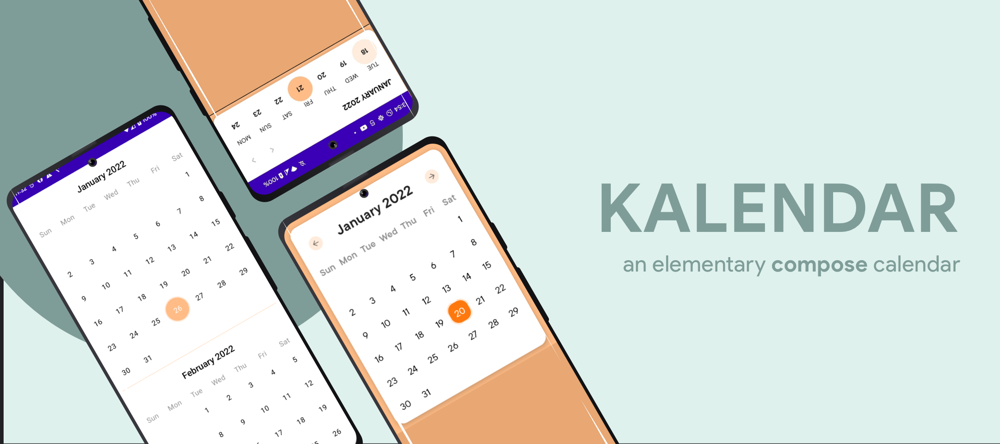
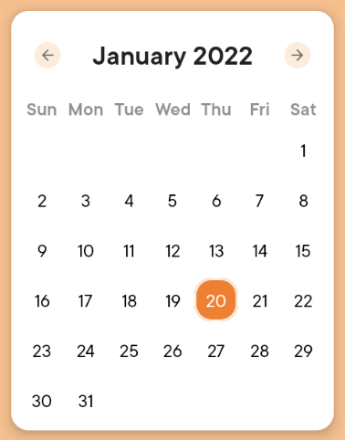
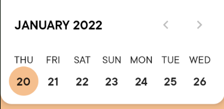
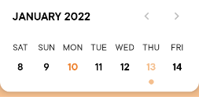

### Kalendar - An Elementary Compose Calendar.



This is a calendar to integrate Calendar with Custom design in your jetpack compose project.You can
also add list of events for your days.
_Made with ❤️ for Android Developers by Himanshu_

[](https://search.maven.org/artifact/com.himanshoe/kalendar)
[](https://github.com/hi-manshu)
[](https://twitter.com/hi_man_shoe)  
[](https://github.com/hi-manshu/Kalendar/releases/latest/download/kalendar-sample.apk)

## Introduction

With Compose getting the attention, it was about time to have its own Calendar. Kalendar is all
about it with the customization and design.

## Implementation

### Gradle setup

In `build.gradle` of app module, include this dependency

```gradle
dependencies {
  implementation("com.himanshoe:kalendar:1.0.0-RC5")
}
```

If you want to use scrolling calendar from current month use `kalendar-endlos`. In `build.gradle` of
app module, include this dependency

```gradle
dependencies {
    implementation("com.himanshoe:kalendar-endlos:1.0.0-RC5")
}
```

### Usage

#### 1. Setup the Kalendar

##### If you are using, the `kalendar` package use,

```kotlin
    Kalendar(kalendarType = KalendarType.Firey(), onCurrentDayClick = { day, event ->
    //handle the date click listener                                                       
}, errorMessage = {
    //Handle the error if any
})
```

##### OR, if you are using `kalendar-endloss` module use,

```kotlin
    Kalendar(onCurrentDayClick = { day, event ->
    //handle the date click listener                                                       
}, errorMessage = {
    //Handle the error if any
})
```

> In `onCurrentDayClick` you will get a `LocalDate` and `KalendarEvent?`.

#### Here, you can also pass optional params:

- **List<KalendarEvent>**: It lets you pass a list of all events in `KalendarEvent` format.
- **KalendarKonfig** : It lets you set the configuration for Kalendar.
- **KalendarStyle** : It lets you setup the design of Kalendar.
- **LocalDate** : the by default selection where the KalendarSelector is placed.

### 2. Pass KalendarType

You need to pass the KalendarType with its value in the constructor. It has two values `Firey`
and `Ocenic`. Firey repesents the MonthView like:



and Ocenic represents the Week View.



### 3. KalendarKonfig

By default it takes the initial values added to it.

```kotlin
data class KalendarKonfig(
    val yearRange: YearRange = YearRange(),
    val firstDayOfWeek: DayOfWeek = DayOfWeek.SUNDAY
)
```

where,

```md
YearRange takes value min to max for years in Int
firstDayOfWeek takes the value for setting custom First day of week with default set to SUNDAY
```

### 4. KalendarStyle

You can customize you calendar by editing the params in `KalendarStyle` which looks like,

```kotlin
data class KalendarStyle(
    val kalendarBackgroundColor: Color? = null,
    val kalendarColor: Color? = null,
    val kalendarSelector: KalendarSelector = KalendarSelector.Circle(),
    val hasRadius: Boolean = true,
    val elevation: Dp = if (hasRadius) Grid.One else Grid.Zero,
    val shape: Shape = ButtomCurvedShape,
)
```

Here, if you have to design and change the selector shape and color you need to configure the
**KalendarSelector** to the Shape. The options here are, `Circle`, `Rounded`, `Dot` and `Square`.

### 5. KalendarSelector

```kotlin
sealed class KalendarSelector(
    val shape: Shape,
    val selectedColor: Color,
    val defaultColor: Color,
    val todayColor: Color,
    val selectedTextColor: Color,
    val defaultTextColor: Color,
    val eventTextColor: Color
) 
```

Here the **KalendarSelector** has 4 different shapes with default colors. If you want to set your
custom color you can pass the shape and your desired color set like,

```kotlin
KalendarSelector.Circle(
    // Colors set based on above variables
)
```

### 6. KalendarEvent

You can also add list of `KalendarEvent` which can be used to list the event for the specific day.
`KalendarEvent` looks like,

```kotlin
data class KalendarEvent(
    val date: LocalDate,
    val eventName: String,
    val eventDescription: String? = null,
    val eventType: EventType = EventType.Event,
)
```

Here,

- date: The Localdate on which the event is recorded
- eventName: Pass a name for the event.
- eventDescription: Pass a description for the event.
- eventType : Pass the type of event, possible values under enum `EventType` { Goal, Reminder, Task, Event }

If the event is marked it looks like,



Here, `10 Jan 2022` is an event on the calendar and you verify it on `onCurrentDayClick`
