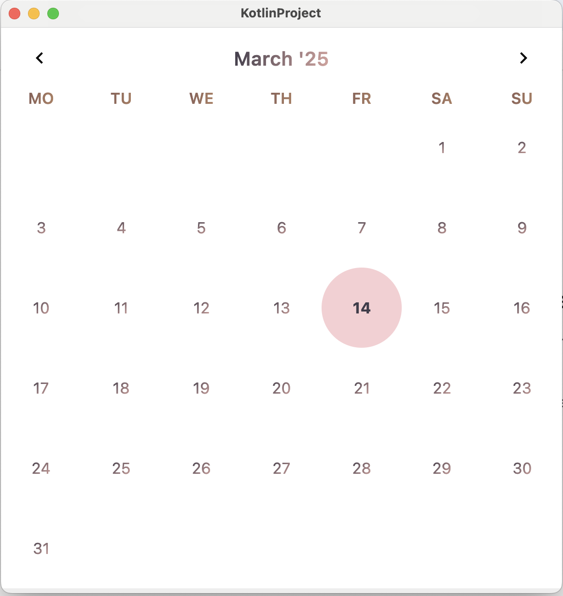
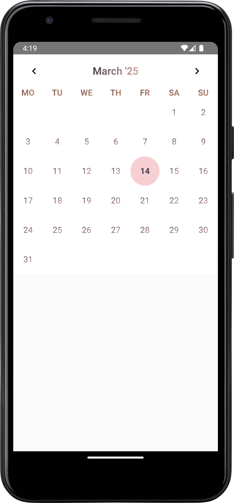
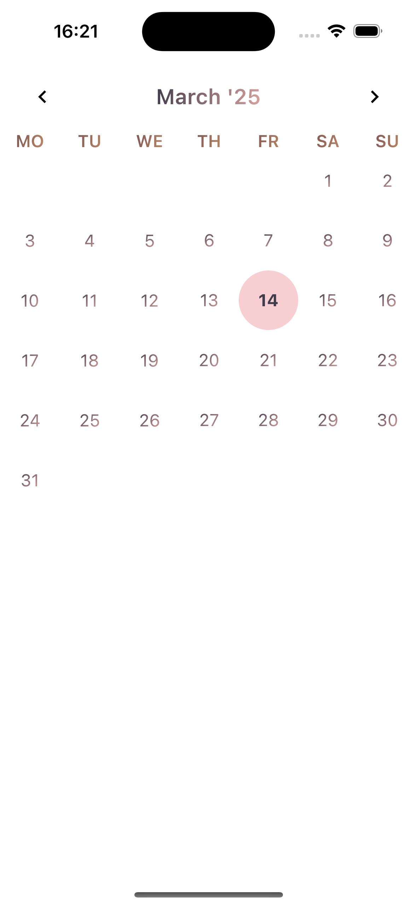

## Kalendar : Oceanic

### Screnshots

| Desktop                                            | Android                                         | iOS                                      |
|----------------------------------------------------|-------------------------------------------------|------------------------------------------|
|  |  |  |


A magical Composable that brings your monthly calendar to life with events, day labels, and more. Perfect for managing your Monthly schedule!

```kotlin
fun Kalendar(
    kalendarType: KalendarType = KalendarType.Oceanic,
    modifier: Modifier = Modifier,
    selectedDate: LocalDate = Clock.System.todayIn(TimeZone.currentSystemDefault()),
    events: KalendarEvents = KalendarEvents(),
    showDayLabel: Boolean = true,
    arrowShown: Boolean = true,
    onDaySelectionAction: OnDaySelectionAction = OnDaySelectionAction.Single { _, _ -> },
    kalendarKonfig: KalendarKonfig = KalendarKonfig(),
    restrictToCurrentWeekOrMonth: Boolean = false,
    startDayOfWeek: DayOfWeek = DayOfWeek.SUNDAY,
) 
```

#### Parameters:

- **kalendarType**  (`KalendarType`): Specifies the type of calendar (e.g., monthly, weekly). Here its Oceanic.
- **modifier**  (`Modifier`): Customizes the appearance and behavior of the calendar.
- **selectedDate**  (`LocalDate`): The selected date, defaulting to the current system date.
- **events**  (`KalendarEvents`): A list of events to display on the calendar.
- **showDayLabel**  (`Boolean`): Whether to display day labels (default: true).
- **arrowShown**  (`Boolean`): Controls visibility of navigation arrows (default: true).
- **onDaySelectionAction**  (`OnDaySelectionAction`): Action to trigger on day selection (default: no-op).
- **kalendarKonfig**  (`KalendarKonfig`): Configuration options for the calendar’s behavior and style.
- **restrictToCurrentWeekOrMonth**  (`Boolean`): Restricts the view to the current week or month (default: false).
- **startDayOfWeek**  (`DayOfWeek`): The day the calendar starts with (default: Sunday).

May your days be filled with wonder, and your schedule always in perfect harmony!
