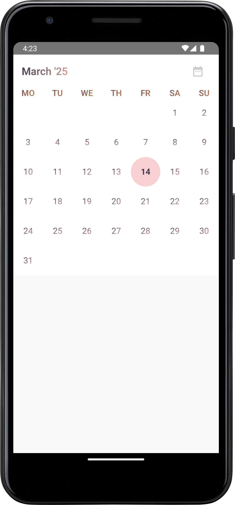
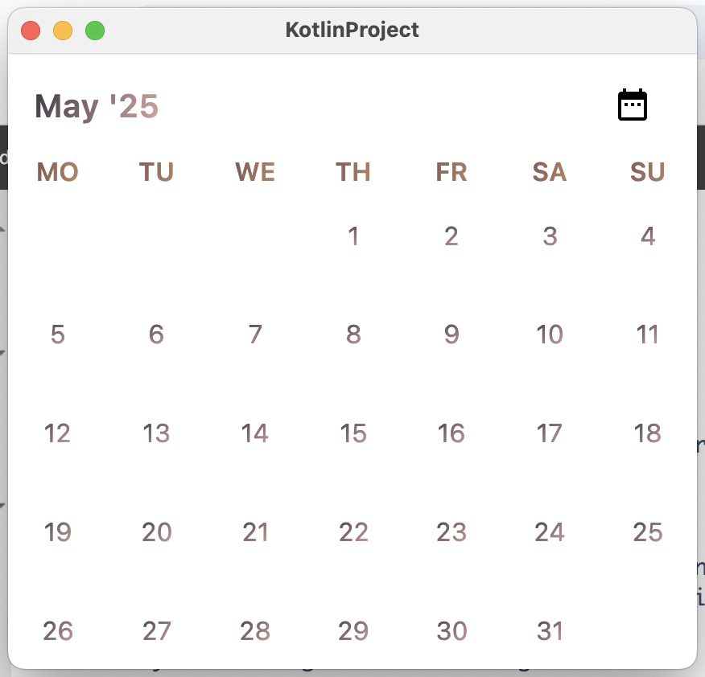
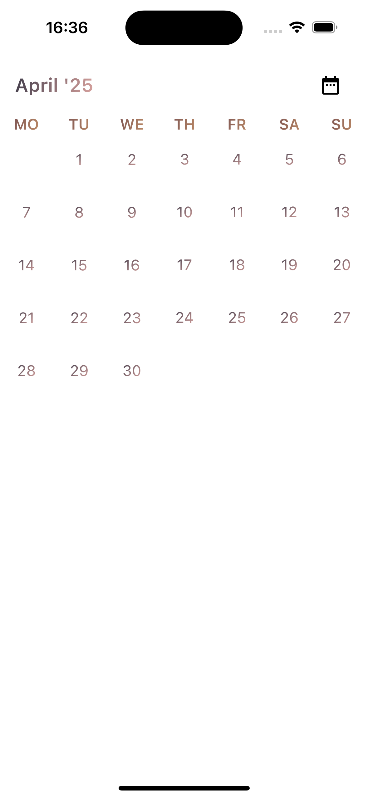

## KalendarSolaris

### Screnshots

<p align="center" style="display: flex; justify-content: center; align-items: center; height: 200px;">
  
  
  
</p>

A magical Composable that brings your swipable monthly calendar to life with events, day labels, and more. Perfect for managing your monthly schedule!

```kotlin
Kalendar(
    selectedDate = Clock.System.todayIn(TimeZone.currentSystemDefault()),
    modifier = Modifier.fillMaxWidth(),
    events = KalendarEvents(),
    startDayOfWeek = DayOfWeek.MONDAY,
    kalendarType = KalendarType.Aerial,
    onDaySelectionAction = OnDaySelectionAction.Range { date, events ->
        println("Selected Date: $date with events: $events")
    },
)
```

#### Parameters:

- **selectedDate**  (`LocalDate`): The date currently selected, guiding the calendar's view.
- **modifier**  (`Modifier`): Customizes the calendar’s appearance, like a wand casting a spell.
- **events**  (`KalendarEvents`): A list of events if appearing on the calendar.
- **showDayLabel**  (`Boolean`): Decides if day labels (like "Monday") are visible.
- **onDaySelectionAction**  (`OnDaySelectionAction`): Action triggered when a day is selected —
  customize it as you please. It can be Single or a range can be selected
- **kalendarKonfig**  (`KalendarKonfig`): Configures the calendar’s magical properties.
- **startDayOfWeek**  (`DayOfWeek`): The day the calendar starts from, by default Sunday.

May your days be filled with wonder, and your schedule always in perfect harmony!
